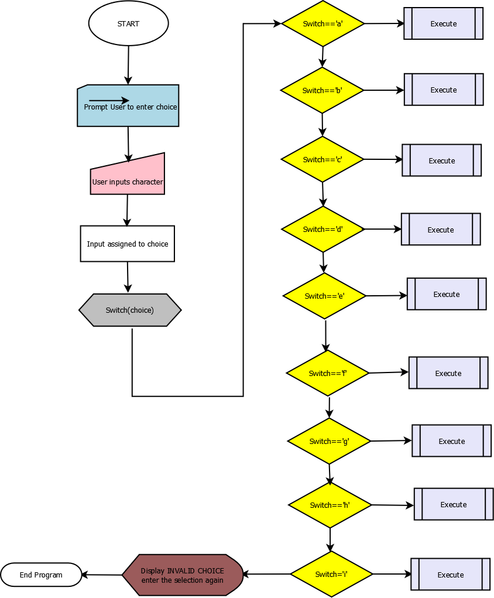
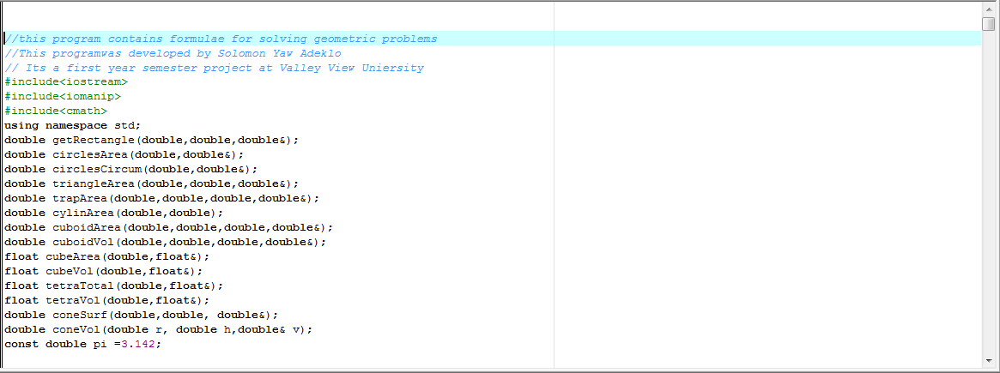

 #Geometry-Software-in-C-Plus-Plus-Console-
 C++ program that  contains formulae for solving geometric problems.The switch control structure was implemented to provide availble
 geometric theory options to the user. Functions and function calls were created to reduce amount of code written.

This Geomerty Software which i created with C++ was a first year semester project work done in 2012.
User can only interact with the system on a command prompt (cmd) console screen. The program will be able 
to solve:   
a.The Area of a Rectancle 
b.Total Surface Area and Volume of a Cube 
c.Area and Circumference of a  Circle 
d.Total and Curved Surface Area of and Volume of a Tetrahedron 
e.Total Surface Area and Volume of a cuboid 
f. Curved Surface Area, Total Surface Area and Volume of a Cone 
g.Surface Area of a Celinder 
h.The Area of a Trapezoid 
i.The Area of a Triangle 

The C++ programming language which was started by  Bjarne Stroutrup at Bell Labs has been a very popular language
in which most programs are written.

IDE used: Dev C++ 4.992

#Flow Chart for the program

Below are the snapshots of the program:

